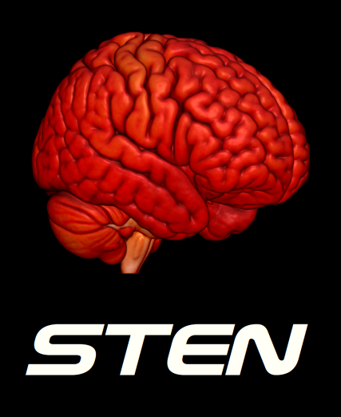

STEN: Statistical Toolbox for Electrical Neuroimaging
=====================================================

STEN is an open source software toolbox based on Python and R that can be used to compute statistics on several measures of electro- and magnetoencephalographic (EEG and MEG) signals.

STEN enables the sample-point and sensor-wise analysis of EEG and MEG data, but also at the level of Global Field Power (GFP) and distributed neural source estimations (e.g. LAURA or LORETA) by means of parametric and non-parametric (bootstrapping) repeated measure ANOVAs, ANCOVAs and regression analyses. Correction thresholds for temporal and spatial auto-correlations in the data can be individually adjusted.

The currently available STEN toolbox is a beta version. All statistical computations and their outcomes have been extensively validated. However, some minor bugs at the visualization level still need to be fixed.

The most commonly used input data for STEN so far are evoked potential files with header (.eph files), i.e. ASCII files (plain metrics files with header) that have been produced with our partner software [CarTool](https://sites.google.com/site/fbmlab/cartool). STEN produces outputs in the .eph format.

Citation
--------

If you used the STEN toolbox in your project, please cite as: Knebel, Jean-François, & Notter, Michael Philipp. (2018, February 1). STEN 2.0: Statistical Toolbox for Electrical Neuroimaging. *Zenodo*. [https://doi.org/10.5281/zenodo.1164151](https://doi.org/10.5281/zenodo.1164151).

Additionally, add the following sentence in the Acknowledgments section:

*The STEN toolbox (https://doi.org/10.5281/zenodo.1164151 has been programmed by Jean-François Knebel and Michael Notter, from the Laboratory for Investigative Neurophysiology (the LINE), Lausanne, Switzerland, and is supported by the Center for Biomedical Imaging (CIBM) of Geneva and Lausanne and by National Center of Competence in Research project “SYNAPSY – The Synaptic Bases of Mental Disease”; project no. 51AU40_125759.*

Installation
------------

The easiest way to install STEN is to use conda to create the necessary python environment to run STEN:

1. If you haven't yet, get conda on your system: https://conda.io/miniconda.html
2. Download the `environment.yml` file from [here]](https://github.com/jfknebel/STEN/blob/master/environment.yml)
3. Open up a conda terminal (or any other terminal), and create a new conda environment with the following command: `conda env create --name sten --file /path/to/file/environment.yml`

Et voilà, STEN is on your system. Now to run STEN, you first need to activate the right conda environment. So, again, open a conda terminal and run the following command:

- Windows: activate sten
- macOS and Linux: source activate sten

Now that you're in the right environment, start STEN with the following command:

`ipython --c "import sten; sten.gui()"`

License information
-------------------

STEN toolbox is a statistical toolbox for EEG anlysis at scalp, GFP and brain scale using R 2.11 and Enthought based on Cartool software files
This program is free software: you can redistribute it and/or modify it under the terms of the GNU General Public License as published by the Free Software Foundation, either version 3 of the License, or any later version. This program is distributed in the hope that it will be useful, but WITHOUT ANY WARRANTY; without even the implied warranty of MERCHANTABILITY or FITNESS FOR A PARTICULAR PURPOSE. See the GNU General Public License for more details.

The full license is in the file ``LICENSE``. The image of the brain in the logo was created with [MRIcroGL])> and the font used is called Ethnocentric Regular, created and licensed by Ray Larabie (http://typodermicfonts.com/).

Acknowledgments
---------------
Gholam Rezaee Mohammad Mehdi (CHUV, Lausanne, Switzerland) and Prof. Stephan Morgenthaler (EPFL, Lausanne, Switzerland) provided substantial advice on statistical issues and the R software. The team of the LINE (www.unil.ch/line) helped and still help by testing STEN and reporting bugs.
